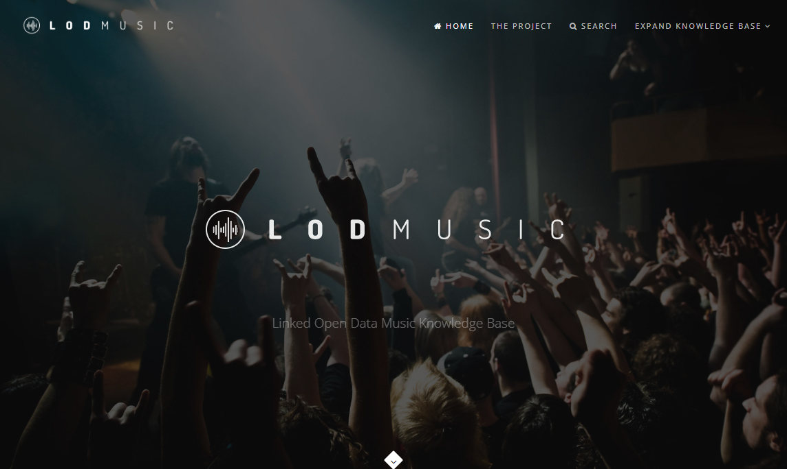
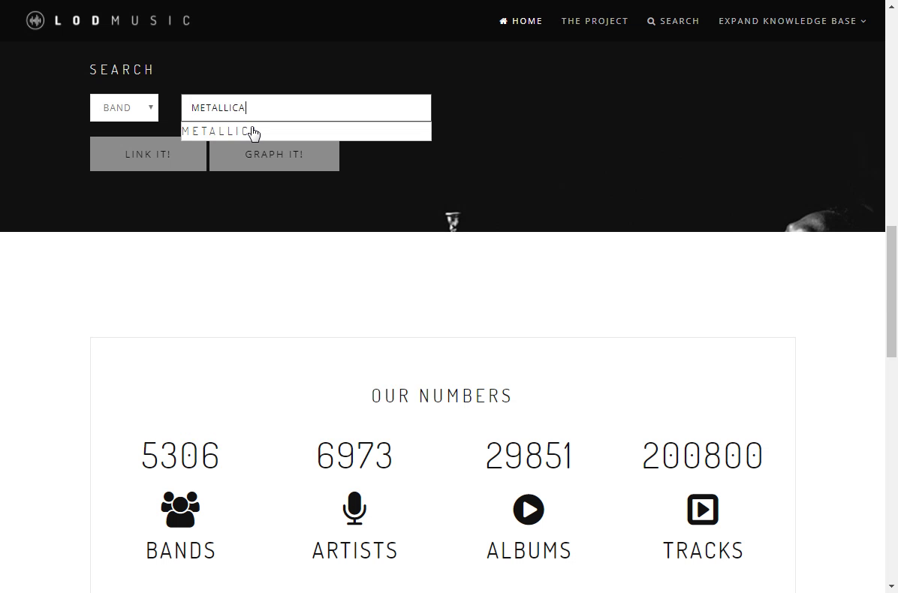
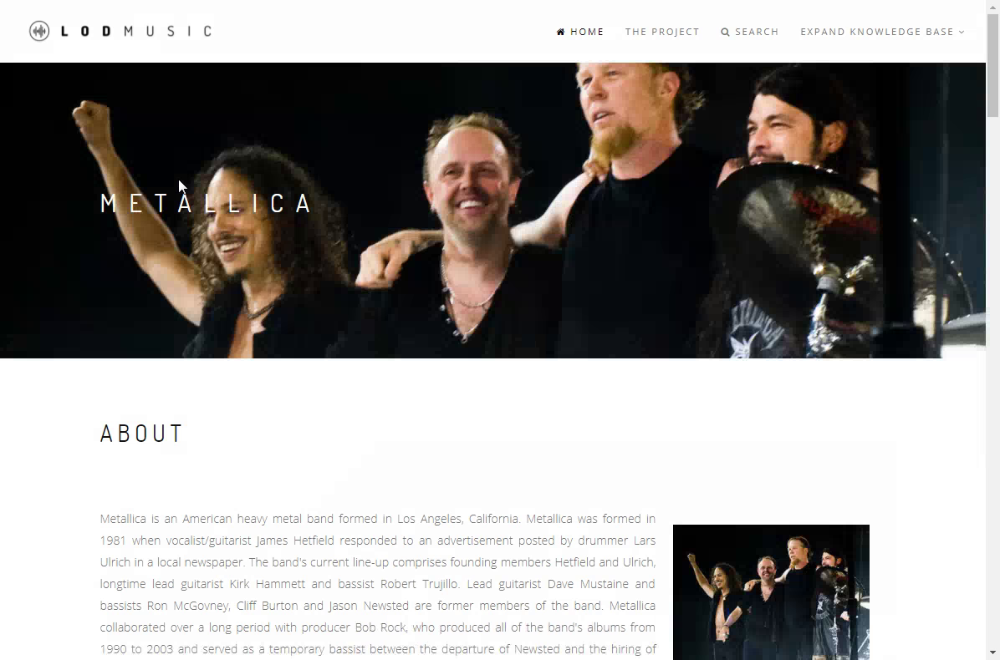
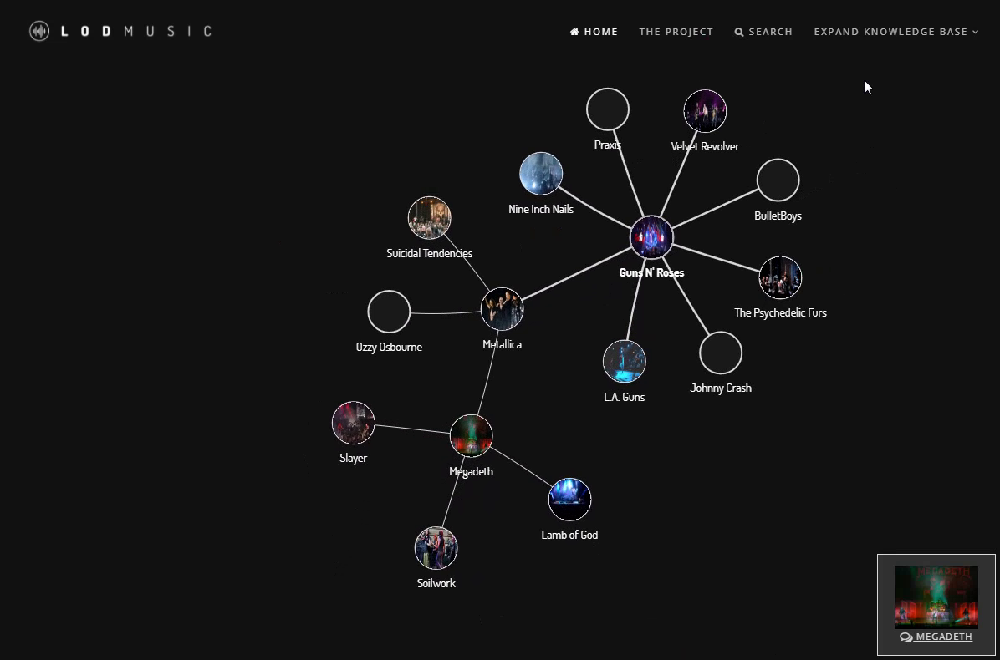
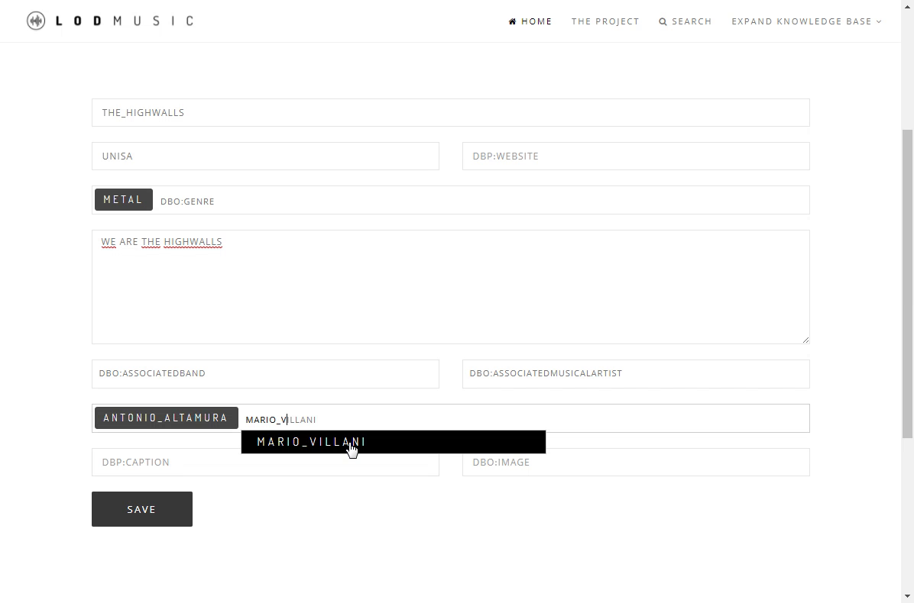

# LodMusic

----
## Installazione
    npm install

----
## Avvio del server
    node bin/www

Applicazione disponibile all'indirizzo [localhost:3000](http://localhost:3000)

## Importazione dei dati (cartella extractorData)

La query deve essere scritta in un file di testo chiamato query.txt (o cambiare il nome del parametro passato alla funzione readQuery in riga 56).

La query da eseguire deve terminare con OFFSET (e uno spazio).

Il file per l'estrazione possiede una funzione sparqlQuery che si occupa di preparare la richiesta HTTP all'endpoint passato come secondo parametro.

La funzione saveFile prende in input un file e memorizza al suo interno i risultati della query. Il file è salvato in formato .ttl (riga 69) per salvare i dati in turtle.

La variabile $chunk è utilizzata per creare il valore dello spiazzamento: ogni query ottiene 40000 triple da dbpedia. Lo spiazzamento è obbligatorio a causa del limite imposto da dbpedia.

La variabile $nullPoint deve essere modificata in base al formato richiesto per la query: ad esempio # Empty TURTLE
"; se richiediamo i dati in rdf.

Per debug sono stati stampati a schermo:
- la query
- il numero di iterazione
- la stringa "Finish" per indicare il termine dell'operazione

## Autori
* Antonio Altamura
* Mario Villani
* Alessandra Zullo

